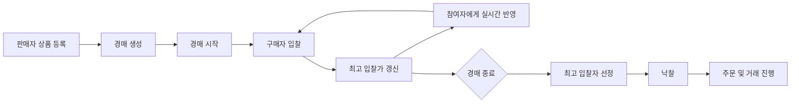
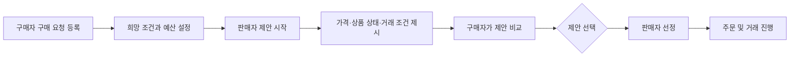
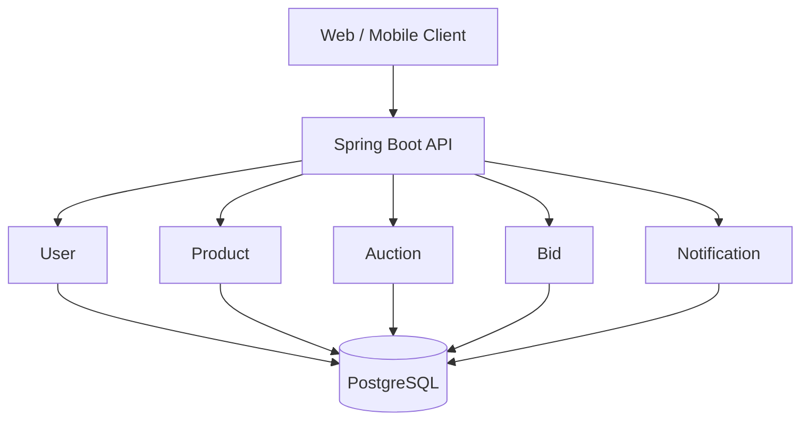

<div align="center">

# CollectBid

### 수집의 가치를 발견하고, 실시간 입찰로 소유하는 컬렉터블 경매 플랫폼

포켓몬 카드, TCG, K-POP 포토카드, LEGO, 피규어 등<br>
희소성과 수집 가치를 지닌 상품을 위한 실시간 중고 경매 서비스입니다.


</div>

---

## 프로젝트 소개

**CollectBid**는 `Collect(수집품)`와 `Bid(입찰)`의 의미를 담고 있습니다.

일반적인 중고거래의 고정가 판매 방식에서 벗어나, 컬렉터블 상품의 희소성과 시세 변화를 반영할 수 있는 **양방향 실시간 입찰 경험**을 제공하는 것이 목표입니다. 판매자가 상품을 등록하면 구매자들이 더 높은 가격을 제시하는 **일반 경매**와, 구매자가 원하는 상품을 요청하면 판매자들이 가격과 판매 조건을 제안하는 **역경매**를 모두 지원합니다.

초기에는 모놀리식 구조로 핵심 도메인을 빠르게 검증하고, 이후 트래픽과 기능 규모에 맞춰 실시간 통신·캐싱·이벤트 기반 구조로 확장할 예정입니다.

> 현재 프로젝트는 초기 개발 단계입니다. 아래 기능과 아키텍처 중 일부는 구현 예정 사항을 포함합니다.

## 주요 기능

| 영역 | 주요 기능 |
| --- | --- |
| 회원 | 회원가입·로그인, 프로필 관리, 구매·판매 활동 내역 |
| 상품 | 상품 등록·수정·삭제, 이미지 및 상품 상태 관리 |
| 일반 경매 | 판매자가 상품을 등록하고 구매자들이 더 높은 구매 가격으로 경쟁 |
| 역경매 | 구매자가 원하는 상품을 요청하고 판매자들이 가격·상품 상태·거래 조건으로 경쟁 |
| 입찰 | 구매자·판매자 실시간 입찰, 입찰 이력 및 동시 입찰 처리 |
| 검색 | 카테고리·가격·상품 상태 필터, 최신순·인기순·마감 임박순 정렬 |
| 관심·알림 | 관심 상품 관리, 상위 입찰자 변경·경매 종료·낙찰 알림 |
| 시세 | 상품별 거래 이력과 시세 데이터 제공 |

### 주요 카테고리

- TCG: Pokémon Card Game, One Piece Card Game, Yu-Gi-Oh!
- K-POP 포토카드
- LEGO 및 미니피규어
- 건담 및 프라모델
- 피규어
- 스포츠 카드 및 굿즈

초기 MVP에서는 일부 카테고리부터 지원하고 서비스 안정화 이후 점진적으로 확장합니다.

## 두 가지 경매 방식

| 구분 | 일반 경매 | 역경매 |
| --- | --- | --- |
| 시작 주체 | 판매자 | 구매자 |
| 경쟁 참여자 | 구매자 | 판매자 |
| 경쟁 방식 | 더 높은 구매 가격 제시 | 더 좋은 판매 가격과 상품 조건 제시 |
| 최종 선택 | 최고 입찰자 낙찰 | 구매자가 판매 제안 선택 |

### 일반 경매 — 구매자 간 경쟁



### 역경매 — 판매자 간 경쟁



## 기술 스택

### 현재 적용

| 구분 | 기술 |
| --- | --- |
| Language | Java 17 |
| Framework | Spring Boot 4.1.1, Spring MVC |
| Data | Spring Data JPA, PostgreSQL Driver |
| Security | Spring Security |
| Validation | Jakarta Bean Validation |
| Build | Maven Wrapper |
| Etc. | Lombok |

### 도입 예정

| 기술 | 사용 목적 |
| --- | --- |
| QueryDSL | 복합 조건 및 동적 쿼리 기반 상품 검색 |
| WebSocket / STOMP | 입찰가와 입찰 내역 실시간 전송 |
| Redis | 캐싱, 최고 입찰가 관리, 동시성 제어, HOT 경매 |
| Apache Kafka | 낙찰·알림 이벤트의 비동기 처리 |
| Elasticsearch | 상품 전문 검색, 자동완성, 검색 성능 개선 |
| Docker / Docker Compose | 일관된 개발 및 실행 환경 구성 |

기술은 기능 구현 과정에서 필요성과 효과를 검증한 뒤 순차적으로 도입합니다.

## 아키텍처

### 초기 구조



초기에는 빠른 개발과 도메인 검증을 위해 **기능 중심 모놀리식 구조**를 사용합니다. 서비스가 성장하면 Redis, Kafka, Elasticsearch를 연결하고 필요에 따라 도메인별 서비스를 분리할 계획입니다.

### 핵심 도메인

```text
User
 ├─ Product
 ├─ Auction
 │   └─ Bid
 ├─ Favorite
 ├─ Order
 └─ Notification
```

예상 엔티티는 `User`, `Product`, `Category`, `Auction`, `Bid`, `Favorite`, `Order`, `Notification`이며 구현 과정에서 책임과 경계에 맞게 조정합니다.

## 개발 로드맵

### Phase 1 — MVP

- [x] Spring Boot 프로젝트 초기 설정
- [ ] PostgreSQL 연결
- [ ] 회원 및 인증·인가
- [ ] 상품·카테고리 CRUD
- [ ] 일반 경매 및 구매자 입찰 기능
- [ ] 역경매 및 판매자 제안 기능
- [ ] 경매 종료와 낙찰 처리

### Phase 2 — 검색

- [ ] QueryDSL 적용
- [ ] 동적 상품·경매 검색
- [ ] 필터, 정렬 및 페이징

### Phase 3 — 실시간 경매

- [ ] WebSocket / STOMP 적용
- [ ] 최고 입찰가 및 입찰 내역 실시간 전송
- [ ] 동시 입찰 처리 전략 적용

### Phase 4 — 성능과 이벤트

- [ ] Redis 캐싱 및 HOT 경매
- [ ] Kafka 기반 경매 종료·낙찰·알림 이벤트
- [ ] Elasticsearch 검색·자동완성

### Phase 5 — 인프라

- [ ] Docker / Docker Compose
- [ ] CI/CD 및 AWS 배포
- [ ] 모니터링, 부하 테스트 및 성능 개선

## 시작하기

### 요구 사항

- JDK 17
- PostgreSQL
- Git

Maven은 프로젝트에 포함된 Maven Wrapper를 사용하므로 별도로 설치하지 않아도 됩니다.

### 저장소 복제

```bash
git clone https://github.com/ckdrmsdl9999/CollectBid.git
cd CollectBid
```

### 데이터베이스 준비

PostgreSQL에서 개발용 데이터베이스를 생성합니다.

```sql
CREATE DATABASE collectbid;
```

`src/main/resources/application.properties`에 로컬 데이터베이스 설정을 추가합니다. 실제 계정 정보는 Git에 커밋하지 않고 환경 변수로 관리합니다.

```properties
spring.datasource.url=jdbc:postgresql://localhost:5432/collectbid
spring.datasource.username=${DB_USERNAME}
spring.datasource.password=${DB_PASSWORD}

spring.jpa.hibernate.ddl-auto=update
spring.jpa.properties.hibernate.format_sql=true
```

### 애플리케이션 실행

Windows:

```bash
mvnw.cmd spring-boot:run
```

macOS / Linux:

```bash
./mvnw spring-boot:run
```

## 패키지 구조

기능 중심 패키지 구조를 기본으로 하며, 다음 형태로 확장할 예정입니다.

```text
com.example.collectbid
├─ global
│  ├─ config
│  ├─ exception
│  ├─ security
│  └─ common
├─ user
│  ├─ controller
│  ├─ service
│  ├─ repository
│  ├─ domain
│  └─ dto
├─ product
├─ auction
└─ bid
```

## 핵심 기술 과제

### 동시 입찰과 데이터 정합성

여러 사용자가 같은 경매에 동시에 입찰하더라도 최고 입찰가와 입찰 순서가 정확해야 합니다. 낙관적 락, 비관적 락, Redis 분산 락을 비교하며 적절한 동시성 제어 전략을 선택합니다.

### 실시간성

새로운 최고가와 입찰 내역을 모든 경매 참여자에게 빠르게 전달할 수 있도록 WebSocket 기반 통신을 검토합니다.

### 정확한 경매 종료

종료 시점에 최고 입찰자를 한 번만 선정하고, 중복 낙찰이나 중복 주문이 생성되지 않도록 멱등성과 트랜잭션 경계를 설계합니다.

### 확장성

입찰 트래픽이 증가하더라도 데이터베이스에 요청이 집중되지 않도록 캐시와 이벤트 기반 처리를 단계적으로 적용합니다.

## 브랜치 및 커밋 규칙

```text
main
└─ develop
   ├─ feature/user
   ├─ feature/product
   ├─ feature/auction
   └─ feature/bid
```

| 타입 | 설명 | 예시 |
| --- | --- | --- |
| `feat` | 새로운 기능 | `feat: 경매 생성 기능 구현` |
| `fix` | 버그 수정 | `fix: 동일 가격 입찰 검증 오류 수정` |
| `refactor` | 코드 구조 개선 | `refactor: AuctionService 책임 분리` |
| `test` | 테스트 추가·수정 | `test: 입찰 동시성 테스트 추가` |
| `docs` | 문서 수정 | `docs: README 실행 방법 추가` |
| `chore` | 설정 및 기타 작업 | `chore: 개발 환경 설정 변경` |

## 프로젝트 목표

- Spring Boot 기반 REST API와 도메인 설계
- JPA 및 PostgreSQL을 활용한 데이터 모델링
- Spring Security 기반 인증·인가
- 실시간 통신과 동시성 문제 해결
- Redis, Kafka, Elasticsearch의 단계적 도입
- 테스트, 모니터링 및 부하 테스트를 통한 성능 개선

## License

This project is developed for portfolio and learning purposes.
