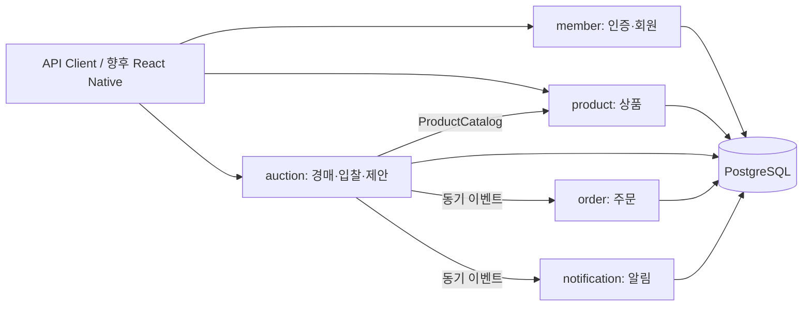

# 아키텍처와 설계 결정

## 현재: 모듈러 모놀리스

한 Spring Boot 프로세스, 한 PostgreSQL, 한 로컬 트랜잭션 관리자를 사용한다.
독립 배포 가능한 MSA를 구현한 상태는 아니다. 서비스 분리 전에 도메인 규칙과 정합성을 검증하는 기준선이다.

### 경계 규칙

- `member`, `product`, `auction`, `order`, `notification`이 기능 모듈이다.
- 각 모듈의 엔티티·Repository·서비스·Controller는 기본적으로 package-private이다.
- 모듈 밖에서는 `api` 패키지의 인터페이스·불변 DTO·이벤트만 참조한다.
- `global`은 오류, 보안 계약, 설정, 페이징 같은 공통 기술 기능만 담는다.
- 모듈 간 JPA 연관관계 대신 ID를 사용한다. 단일 DB의 무결성을 위해 SQL 외래 키는 유지한다.
- `ArchUnit` 테스트가 모듈 우회 참조와 순환 의존성을 검사한다.
- 파일 수가 늘면 모듈 내부를 계층별로 분리한다. 지금은 짧은 모듈을 평평하게 두어 흐름을 따라가기 쉽게 했다.

## ADR-001: JPA + QueryDSL JPA

쓰기에는 JPA 변경 감지를 사용하고, 동적 검색에는 같은 `EntityManager`를 사용하는 QueryDSL JPA를 사용한다.
MyBatis와 QueryDSL SQL은 사용하지 않는다. 다른 모듈의 Repository를 직접 호출하지 않는다.
QueryDSL 벌크 수정도 현재 사용하지 않는다.

QueryDSL은 OpenFeign 포크의 `io.github.openfeign.querydsl`을 사용한다. Spring Data의
[공식 설정 문서](https://docs.spring.io/spring-data/jpa/reference/repositories/core-extensions.html)를 기준으로
Q 타입 생성기를 구성했다. 버전 속성은 Boot의 원본 QueryDSL 버전을 덮어쓰지 않도록 별도 이름을 사용한다.

조회 결과는 DTO로 변환하며 Open Session in View를 끈다. 컬렉션 fetch join과 페이징을 혼합하지 않는다.
조회용 native SQL이 필요해지면 실제 실행 계획과 측정 결과를 근거로 추가한다.

## ADR-002: 경매와 입찰은 하나의 일관성 경계

입찰 이력 저장과 최고가 변경은 반드시 함께 성공해야 한다. 경매와 입찰을 별도 서비스로 나누지 않는다.

### 일반 경매 입찰

1. 경매 행에 `PESSIMISTIC_WRITE` 잠금을 획득한다.
2. `(auction_id, bidder_id, request_key)`로 기존 성공 요청을 확인한다.
3. 잠금을 얻은 **뒤** 서버 `Clock`으로 종료 시각을 검사한다.
4. 자기 입찰, 가격 범위, 최소 증가액을 검사한다.
5. 최고가 변경·입찰 이력·상위 입찰자 변경 알림을 같은 트랜잭션에서 저장한다.

동일 요청 키와 동일 본문은 기존 결과를 반환한다. 다른 본문으로 같은 키를 재사용하면 409다.
첫 입찰은 시작가 이상, 이후 입찰은 현재가 + 최소 증가액 이상이다. 금액은 원 단위 정수 `long`이다.
정확히 종료 시각이 되면 입찰은 거절한다. `@Version`도 있지만 쓰기 직렬화의 주 수단은 행 잠금이다.

서로 다른 경매는 서로 다른 행을 잠근다. 인기 경매 한 건에는 대기열이 생긴다.
DB의 잠금 대기 제한은 5초이며, 성능 한계는 아직 부하 테스트로 측정하지 않았다.

### 출품과 상품 상태

`AVAILABLE → LISTED → SOLD`, 유찰·취소 시 `LISTED → AVAILABLE`이다.
상품 행 잠금과 활성 출품에 대한 부분 유니크 인덱스로 중복 출품을 막는다.
출품 중·판매 완료 상품의 수정과 삭제를 금지한다. 상품 삭제는 `DELETED` 상태로 보존한다.

### 종료와 주문

종료·취소·입찰은 같은 경매 행을 잠근다. 종료 처리는 상태를 재검사해 반복 호출에도 안전하다.
5초 주기의 작업이 기한이 지난 경매를 최대 100건 조회하고, 경매별 독립 트랜잭션으로 종료한다.
서버 재시작 후에도 DB에서 미처리 경매를 찾는다. 종료 작업이 늦더라도 기한 이후 입찰은 거절한다.

낙찰 시 상품 상태를 변경하고 `AuctionSettled`를 발행한다. 주문과 알림은 **동기 `@EventListener`**로
같은 트랜잭션에 참여한다. 주문 저장이 실패하면 낙찰·상품 상태·알림도 롤백된다.
`trade_orders.auction_id`, `product_id` 유니크 제약이 중복 주문을 추가로 방어한다.

현재 이벤트는 Kafka 메시지가 아니다. `@Async` 또는 `AFTER_COMMIT` 리스너로 단순 변경하면
현재의 원자성이 사라진다. 외부 전송에는 별도의 Outbox와 멱등 소비자 설계가 필요하다.

## ADR-003: 역경매는 구매자 선택 방식

- 구매자가 예산·카테고리·종료 시각을 지정한다.
- 판매자는 자신이 소유한 판매 가능한 상품으로 예산 이하의 제안을 한다.
- MVP에서는 판매자당 한 요청에 하나의 제안만 허용하며 수정·철회는 아직 없다.
- 제안 단계에서는 상품을 예약하지 않는다. 같은 상품으로 다른 거래를 진행할 수 있다.
- 구매자는 전체 제안을, 판매자는 자신의 제안만 조회한다.
- 구매자가 선택할 때 `경매 → 상품` 순서로 잠근다.
- 제안 당시 상품 스냅샷과 현재 상품 정보가 다르거나 다른 거래가 예약·판매했다면 선택을 거절한다.
- 선택 시점에도 기한을 검사한다. 성공하면 주문을 만들고 경매를 종료한다.
- 선택 없이 기한이 지나면 유찰이다. 최저가를 자동 선택하지 않는다.

단순한 “가격이 내려가는 일반 경매”와 구분하기 위한 결정이다. 제안 변경·재제안은 이후 정책을 정해 추가한다.

## ADR-004: 초기 인증은 만료 가능한 불투명 Bearer 토큰

이메일은 소문자로 정규화하고 비밀번호는 Spring Security BCrypt로 해시한다.
로그인 시 256비트 난수 토큰을 생성하며 DB에는 SHA-256 해시만 저장한다. 원문은 로그인 응답에만 나온다.
토큰은 2시간 후 만료하며 로그아웃하면 해당 토큰을 폐기한다. 자동 갱신은 없다.

JWT 키 배포·갱신·폐기 정책보다 MVP의 명확한 만료와 로그아웃을 우선했다.
현재는 인증 요청마다 DB를 조회한다. MSA에서는 OAuth2/OIDC 또는 중앙 인증 서비스 도입을 별도로 검토한다.
인증은 `Authorization` 헤더만 사용한다. 쿠키·세션 인증이 없으므로 CSRF를 비활성화했다.
브라우저 클라이언트를 추가할 때는 허용 Origin과 토큰 저장 방식을 함께 설계해야 한다.

## 현재 한계와 서비스 분리 비용

- 알림 장애가 입찰·낙찰에도 영향을 준다. 동기 처리의 결합을 명시적으로 받아들인 상태다.
- 스케줄러는 프로세스별로 돈다. 여러 인스턴스에서도 DB 잠금이 중복 처리를 막지만 중복 조회 비용은 남는다.
- 오래된 특정 경매 100건이 계속 실패하면 후속 종료가 밀릴 수 있다. 운영 단계에서 재시도 관리와 모니터링이 필요하다.
- 부분 문자열 검색, offset 페이징, 정확한 count의 비용을 아직 측정하지 않았다.
- 교차 모듈 외래 키와 동기 트랜잭션은 MSA 전환 때 변경해야 한다. 패키지 분리만으로 전환이 끝나지 않는다.
- 결제·배송·환불, 외부 푸시, 관심 목록, 시세, 파일 업로드, 비밀번호 재설정, 이메일 인증, 로그인 시도 제한은 미구현이다.
- 상품 이미지는 HTTPS URL 한 개만 보관한다. 서버가 URL을 내려받거나 파일을 업로드하지 않는다.

우선 알림을 Outbox 기반으로 분리하고, 주문 분리 시 결제 실패와 보상 정책을 설계한다.
경매·입찰의 핵심 쓰기 경계는 실제 독립 확장 필요성이 확인되기 전까지 유지한다.
